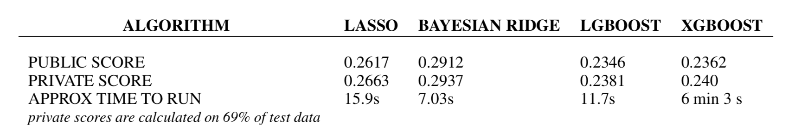

# Avito-On-Demand-Prediction-challenge

The online advertisement industry is filled with a variety of advertisements that suffer from lack of proper optimization. 
The project aims at predicting the probability of online ads sale going through based on a variety of categorical and numerical features like category, geographical location and price or date respectively along with historical demand for such ads.
Kaggle Competition https://www.kaggle.com/c/avito-demand-prediction

3 Exploratory Data Analysis
4 Data Preprocessing
Handling Missing Data
115 4.2 Handling Categorical Features
5 Implementation of Algorithms
146 5.1 Bayes Ridge Regression  
5.2 Lasso
5.3 XG Boost Regression 
5.4 Light Gradient Boosting Regression

Comparison of Scores
 

