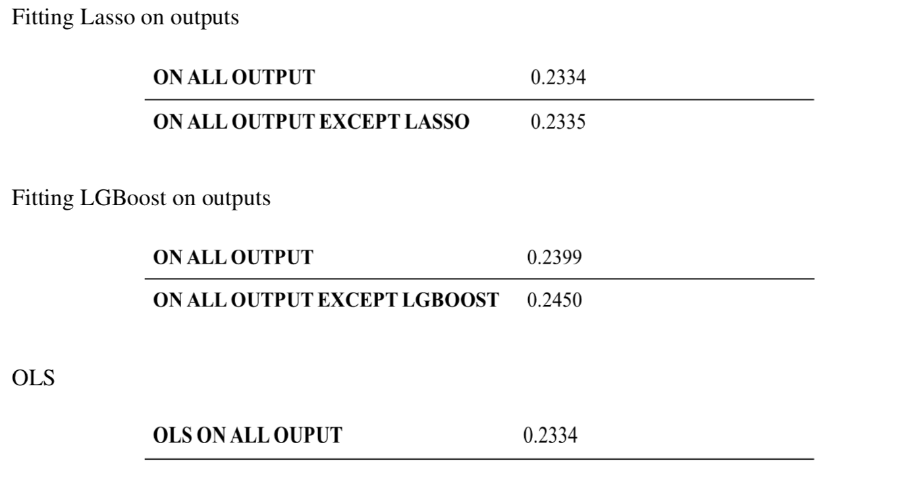

# Avito-On-Demand-Prediction-challenge

The online advertisement industry is filled with a variety of advertisements that suffer from lack of proper optimization. 
The project aims at predicting the probability of online ads sale going through based on a variety of categorical and numerical features like category, geographical location and price or date respectively along with historical demand for such ads.
Kaggle Competition https://www.kaggle.com/c/avito-demand-prediction

1. Exploratory Data Analysis
2. Data Preprocessing
 - Handling Missing Data
 - Handling Categorical Features
3. Applying following Algorithms
 i. Bayes Ridge Regression  
 ii. Lasso
 iii. XG Boost Regression 
 iv. Light Gradient Boosting Regression

Comparison of Scores
 

4. Stacking the output of indivisual algorithm as input  
Comparison of Scores after stacking 

